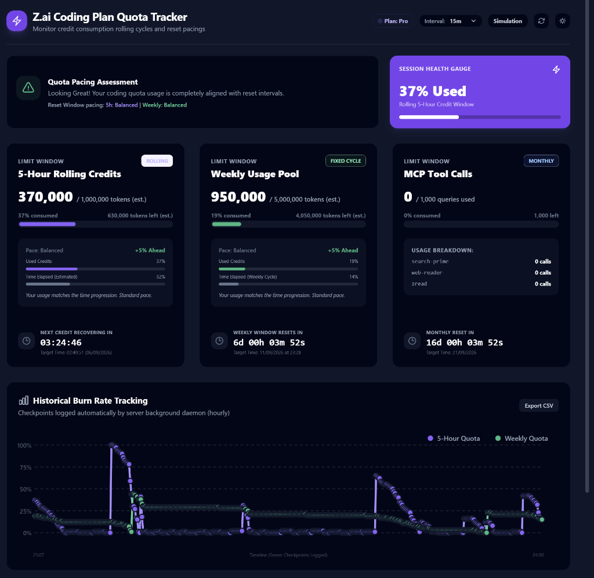

# Z.ai Coding Plan Quota Dashboard

A lightweight, zero-dependency Server-Side Rendered (SSR) dashboard to monitor and track your Z.ai GLM Coding Plan usage vs. remaining time before quota reset.

<p align="center">
  
</p>

---

## ✨ Features

- **SSR Secure Architecture**: Zero proxy endpoints or client-side API fetches. The server queries Z.ai directly; your API key is never sent to the browser.
- **Strictly Read-Only**: Enforces `GET`/`HEAD` methods only (returns `405 Method Not Allowed` for any mutating requests).
- **Pacing Index**: Compares credit consumption percentages to elapsed window duration, alerting you if you are outpacing time decay.
- **5-Hour Rolling Limit**: Real-time ticker counting down to when your rolling window credits begin to recover.
- **Weekly Pool**: High-visibility tracker for your weekly cap, complete with reset countdown and estimated token counts.
- **MCP Tool Calls**: Tracks monthly MCP web search / reader calls usage.
- **Background History Daemon**: Automatically logs usage checkpoints to a local `history.json` file once every hour.
- **Simulation Mode**: Adjust sliders on the UI to preview dashboard metrics, gauges, and historical burn rate graphs without inputting a real key.
- **Hardened Security**: Includes strict Content-Security-Policy (CSP), `nosniff`, `DENY` framing, in-memory rate-limiting/caching (15s TTL), and path traversal protection.
- **Dark Mode Support**: Adapts cleanly to dark/light browser setups.

---

## 🚀 Running Locally (Native Node.js)

### Prerequisites
- Node.js 18+ *(no external production dependencies required)*

<details>
<summary><b>📦 Need to install Node.js on a fresh Ubuntu / Debian server?</b> (Click to expand)</summary>

```bash
# Install Node.js 20 LTS via NodeSource
curl -fsSL https://deb.nodesource.com/setup_20.x | sudo -E bash -
sudo apt-get install -y nodejs

# Verify installation
node -v
```
</details>

### Step 1: Clone the Repository
```bash
git clone https://github.com/SkyStation3/zai-quota-dashboard.git
cd zai-quota-dashboard
```

### Step 2: Configure Environment Variables
Copy the example environment file:
```bash
cp .env.example .env
```
Edit `.env` and insert your Z.ai API key:
```env
Z_AI_API_KEY=your_actual_zai_api_key_here
HOST=0.0.0.0
PORT=3000
```

### Step 3: Build & Start
```bash
# Optional: re-compile frontend bundle if you made changes (requires devDependencies)
npm install
npm run build

# Start server
npm start
# or: node server.js
```

### Step 4: Access the Dashboard
Open your browser at:
```
http://localhost:3000
```

---

## 🐳 Running with Docker

### Option A: Docker Compose (Recommended)

1. **Configure `.env`**:
   ```bash
   cp .env.example .env
   # Edit .env and set your Z_AI_API_KEY
   ```

2. **Start the container in the background**:
   ```bash
   docker compose up -d --build
   ```

3. **Check status & logs**:
   ```bash
   docker compose logs -f
   ```

4. **Stop the container**:
   ```bash
   docker compose down
   ```

*Historical usage data is automatically persisted in the `history-data` Docker volume across restarts.*

---

### Option B: Docker CLI

1. **Build the Docker image**:
   ```bash
   docker build -t zai-dashboard .
   ```

2. **Run the container**:
   ```bash
   docker run -d \
     --name zai-dashboard \
     --restart unless-stopped \
     -p 3000:3000 \
     -e Z_AI_API_KEY="your_actual_zai_api_key_here" \
     -v zai_history:/app/history-data \
     -e HISTORY_FILE="/app/history-data/history.json" \
     zai-dashboard
   ```

---

## ⚙️ Environment Variables Reference

| Variable | Default | Description |
| :--- | :--- | :--- |
| `Z_AI_API_KEY` | *(Required)* | Your Z.ai API key obtained from [z.ai](https://z.ai). |
| `HOST` | `0.0.0.0` | Network interface to bind (`0.0.0.0` for LAN/Docker, `127.0.0.1` for loopback/tunnel only). |
| `PORT` | `3000` | HTTP port the server listens on. |
| `HISTORY_FILE`| `./history.json` | Path where historical usage checkpoints are persisted. |

> **Note on `.env` parsing**: System/shell environment variables take precedence over values defined in `.env`. Within `.env` itself, later lines will override earlier lines.

---

## 🔌 Read-Only Stats API

The server exposes a lightweight, strictly read-only JSON endpoint at `GET /api/stats` (or `GET /api/quota`) for easy integration into status bars, home automations (Home Assistant), Waybar, Polybar, or scripts.

### Example Request
```bash
curl -s http://localhost:3000/api/stats
```

### Example Response
```json
{
  "success": true,
  "planTier": "pro",
  "timestamp": 1788628163562,
  "rolling5h": {
    "usagePercent": 37,
    "timeElapsedPercent": 32.4,
    "pacingDifferencePercent": 4.6,
    "estimatedUsedTokens": 370000,
    "estimatedRemainingTokens": 630000,
    "estimatedTotalTokens": 1000000,
    "nextResetTime": 1788640000000,
    "nextResetIso": "2026-09-06T06:40:00.000Z",
    "timeRemainingMs": 11836438,
    "earlyRunoutMs": null
  },
  "weekly": {
    "usagePercent": 19,
    "timeElapsedPercent": 14.2,
    "pacingDifferencePercent": 4.8,
    "estimatedUsedTokens": 950000,
    "estimatedRemainingTokens": 4050000,
    "estimatedTotalTokens": 5000000,
    "nextResetTime": 1789140480000,
    "nextResetIso": "2026-09-11T23:28:00.000Z",
    "timeRemainingMs": 512316438,
    "earlyRunoutMs": null
  },
  "mcpSearch": {
    "usedQueries": 0,
    "totalQueries": 1000,
    "remainingQueries": 1000,
    "usagePercent": 0,
    "nextResetTime": 1790000000000,
    "nextResetIso": "2026-09-21T22:13:20.000Z",
    "usageDetails": []
  }
}
```
*(Responses automatically leverage the server's 15-second in-memory cache, so frequent polling will not exhaust Z.ai API rate limits).*

---

## 🔒 Security & Architecture Overview

- **No Upstream Proxying**: The server does not proxy arbitrary completion requests.
- **Read-Only**: Zero mutating endpoints (`POST`, `PUT`, `DELETE` are rejected with HTTP 405).
- **Backend Caching**: 15-second in-memory cache on Z.ai lookups to avoid rate limiting.
- **Zero Production npm Dependencies**: Runtime runs strictly on native Node.js core modules (`http`, `https`, `fs`, `path`, `url`, `crypto`).

---

## 📄 License

This project is licensed under the **BSD Zero Clause License (0BSD)** - see the [LICENSE](LICENSE) file for details. Free for all commercial and private use with zero restrictions.
